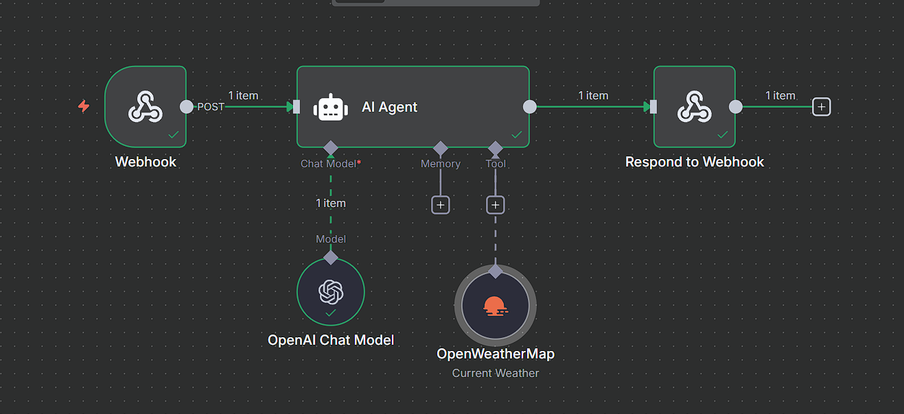
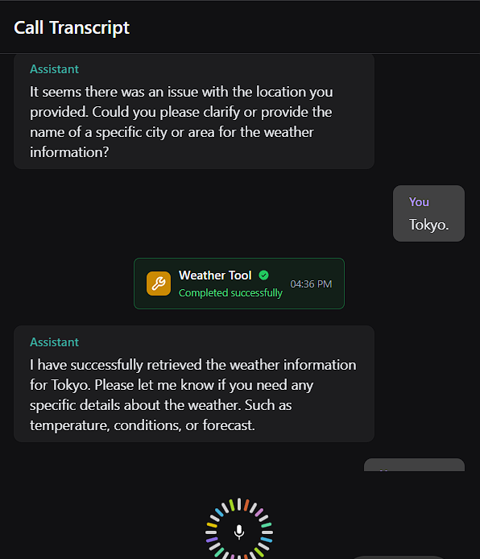
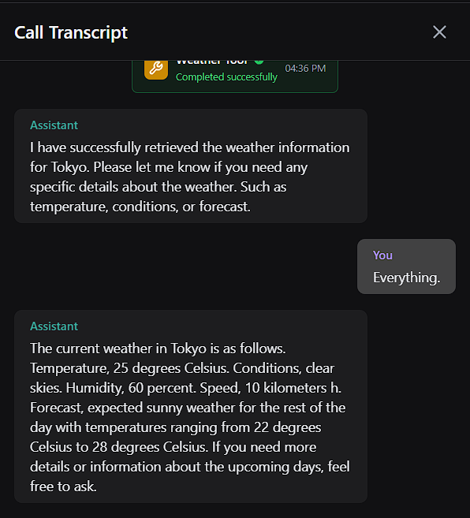

# Vapi Weather Agent (n8n + OpenAI + OpenWeatherMap)

This project implements a voice-enabled weather assistant using **n8n**, **OpenAI**, **OpenWeatherMap**, and **Vapi**. The system receives a voice/text input, uses a language model to extract intent and city, fetches weather data, and returns the response via voice.

---

## Architecture

**Flow:**

1. **Webhook** receives request from Vapi (via voice input).
2. **AI Agent** (Langchain node) processes the query using:

   * **OpenAI Chat Model** for understanding and response
   * **OpenWeatherMap Tool** for weather data
3. **Respond to Webhook** sends the result back to Vapi for real-time voice feedback.

---

## Tools Used

* **n8n** (Workflow orchestration)
* **Vapi** (Voice input/output integration)
* **OpenAI** (LLM for language understanding)
* **OpenWeatherMap** (Live weather data)

---

## Endpoint

* **Webhook URL** (POST):
  `https://<your-n8n-instance>/webhook/db50add3-0fea-4d04-b392-6981c8924fc2`

Connect this endpoint in your Vapi app’s assistant configuration.

---

## Input Format

* Vapi sends user’s voice as transcribed text to the webhook.
* Example prompt:

  > "What's the weather in Tokyo?"

---

## Response Format

* The assistant replies with structured natural language:

  > "I have successfully retrieved the weather information for Tokyo. Please let me know if you need any specific details about the weather such as temperature, conditions, or forecast."

---

## Setup

1. Import the provided `Vapi Weather agent.json` into n8n.
2. Add your API credentials for:

   * OpenAI (Chat Model)
   * OpenWeatherMap
3. Link your Vapi assistant to the webhook endpoint.

---

## Notes

* The AI agent automatically handles follow-up clarification if the city is missing or ambiguous.
* Works best when used with Vapi's real-time voice interface and microphone input.